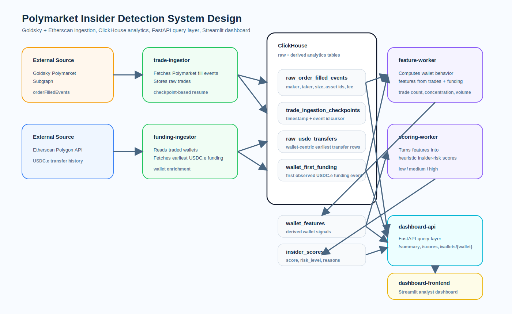
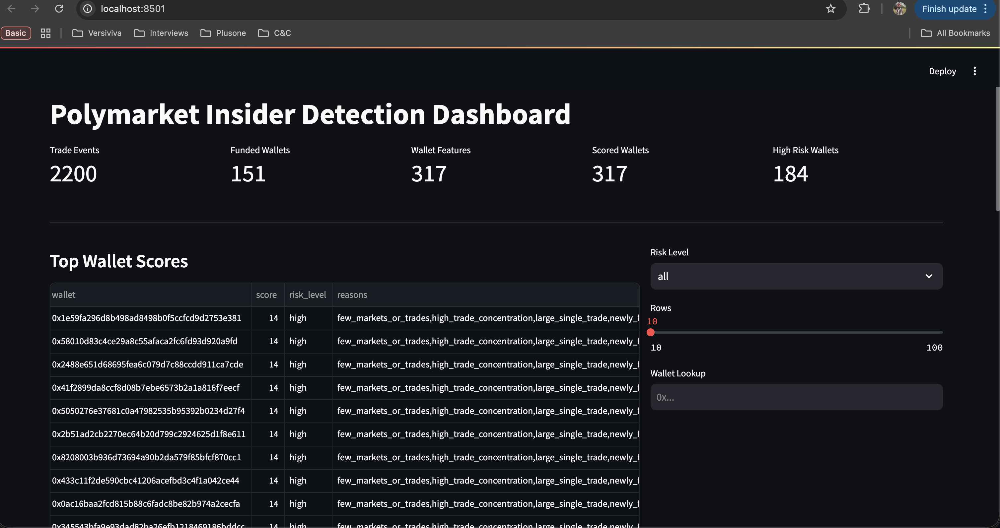
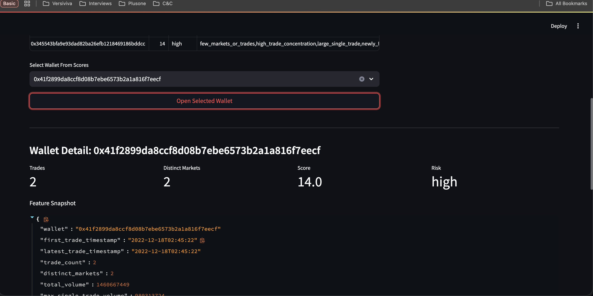
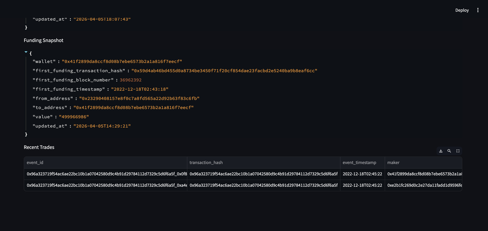

# Insider Trading

This repo currently contains the local services:

- `clickhouse`: analytics database
- `trade-ingestor`: polls the Polymarket Goldsky subgraph and stores raw `orderFilledEvents`
- `funding-ingestor`: looks up first USDC.e funding activity for traded wallets via Etherscan
- `feature-worker`: derives wallet-level features from trades and funding history
- `scoring-worker`: produces heuristic insider-risk scores from wallet features
- `dashboard-api`: FastAPI query service over ClickHouse
- `dashboard-frontend`: Streamlit dashboard that calls the FastAPI backend

## System Design



## Screenshots







## Getting Started

```bash
make up
make ps
make logs
```

Docker Compose reads local secrets from `.env`.

Dashboard URL after startup:

- Frontend : `http://localhost:8501`

To inspect ClickHouse:

```bash
make clickhouse-client
```
